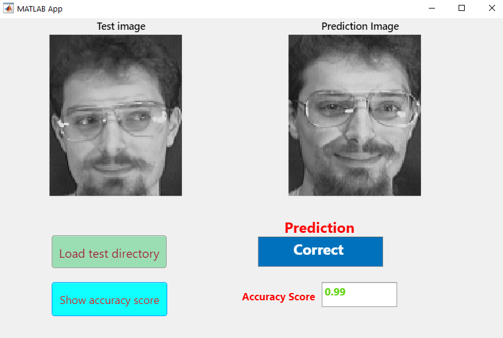
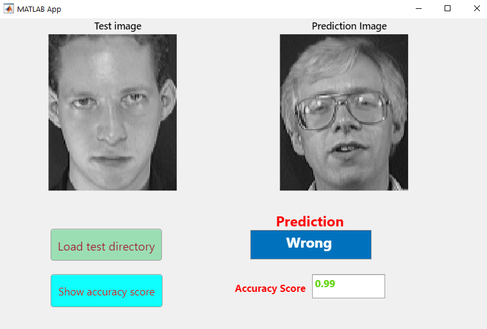

# Project CITS4402
### Daniel Hess: 21971897
### Shuo Tan: 21932355
### Hank Hoang: 22783195


## 1. Approach and partition
The goal of this project is to replicate the classifier built in the provided paper. Essentially the process is that we define a matrix (which we'll call the H matrix - definition is provided in the PAMI paper). Given an image and this H matrix we can calculate an estimate which is linear combination of our training images for a class. Given the error original image and this estimate/analog we can calculate the error for the given class. If we take calculate which class produces the minimum error for a given image, we can say that our prediction is from that class.

The process we need to follows involves taking a set number of images from a class, splitting them into a training set and testing set, after we can of course perform training and testing.

The partition process takes a given value for the training proportion (p) and a seed, then takes a random sample of images from a class, equal to the provided p value. Inclusion of the seed value allows us to recreate results.

The training process is well defined in the PAMI paper, and later in this readme. The process involves calculation of the H matrices mentioned earlier.

Finally during testing, a prediction function will calculate which class has the smallest error and make a prediction.

## 2. Display of GUI and examples




## 3. Folder Structure details
Working directory structure is as below:

```
.
+-- rm_images
|   +-- correct.png
|   +-- wrong.png
|
+-- source_imgs
|   +-- s1
|   |   +-- 1.pgm
|   |   +-- 2.pgm
|   |   +-- ...
|   +-- ...
|
+-- test *
|   +-- c1_1.pgm
|   +-- c1_4.pgm
|   +-- ...
|
+-- train *
|   +-- c1_2.pgm
|   +-- c1_3.pgm
|   +-- ...
|
+-- train_src
|   +-- gen_all_mats.m
|   +-- gen_h_matrix.m
|   +-- gen_x_matrix.m
|   +-- read_h_mat.m
|
+-- allHatMatrices.txt *
+-- allHatSize.txt *
+-- predict.m
+-- project_gui.m
+-- train_func.m
+-- train_save.m
+-- ReadMe.md
```

Files/Folders marked with * may not appear until training has been run.

The *source_imgs* folder is a folder containing all the images from all the classes. Each class has its own subdirectory. The name of the folder and the name of each image do not need to follow any naming structure as the model will produce its own class numbers and image instances.

The *train* and *test* folders are folders generated during training to separate which images are training and testing. The files in this folder follow a specific naming scheme, the number after the *c* is the class number and the number after the underscore is the numbered instance from the source folder.

The *train_src* folder contains the functions used to perform training. The files in this folder are explained in detail later.

The files *allHatMatrices.txt* and *allHatSize.txt* are used for saving the trained model - this gives us the option to re-use already generated matrices for prediction and classification.

*project_gui.m* is the GUI MATLAB application used for testing. This will cycle through testing instances showing which images it gets right and wrong.

*train_func.m* is a script that runs the training process given some parameters. The output of this function is a 3D matrix of all the H matrices. *train_save.m* does the same training process however saves the model into the working directory as the two files: *allHatMatrices.txt* and *allHatSize.txt*.

The folder *rm_images* just contains images for this readme.


## 4. Detailed code running procedure
### Training
With MATLAB running and while in the working directory, run *train_save.m*. Running this script will allow you to use the default parameters provided in the script, however if you open the file, these parameters can be changed.

 - tr_prop: will change the training proportion (recommended 0.5)
 - dim: imaging scaling proportion / dimensionality reduction (can take array of size 2 for specific resolution or float for scaling. Recommended 0.1)
 - seed: will change the random seed for image sampling (see results for recommendations)
    
Running this script will remove the contents of the folders *train* and *test*. It will also add *train_src* to the path.

### Testing GUI
Run the GUI application *project_gui.m*. Pressing the button *Load test directory* locate the generated *test* folder. The GUI will now automatically cycle through each image in the folder and show the image and a training image from the corresponding predicted class. If you press the *Show accuracy score* button you will see the prediction accuracy of the model.

The GUI reads the matrices from the directory so there is no need to run training prior to testing if the matrices have been generated.

## 5. Results
Using accuracy as our comparison metric, we looked at the difference the training proportion has on the accuracy. For each model we used *dim=0.2*. The procedure was as follows:

 1. Define what training proportions to test.
 2. 30 random seeds were chosen. The same 30 seeds were used for each training proportion.
 3. For each training proportion and random seed, a model was trained then tested for accuracy.
 4. For each training proportion the max and mean accuracy were taken as well as the seed used to reproduce.

 The results are below: 
 

| Training Proportion | Max Accuracy | Mean Accuracy | Seed for Max |
| --- | --- | --- | --- |
| 0.1 | 0.7444 | 0.7142 | 724456 |
| 0.2 | 0.8875 | 0.8515 | 175452 |
| 0.3 | 0.9500 | 0.9177 | 361789 |
| 0.4 | 0.9792 | 0.9479 | 226852 |
| **0.5** | **0.9900** | **0.9662** | **226852** |
| 0.6 | 1.0000 | 0.9758 | 719469 |
| 0.7 | 1.0000 | 0.9817 | 182492 |
| 0.8 | 1.0000 | 0.9867 | 398045 |
| 0.9 | 1.0000 | 0.9892 | 398045 |
